# PAUTAS 

## CURSO 2024/2025


Tabla de contenido
COMPETENCIAS PROFESIONALES: ..... 2
SUPUESTOS PRÁCTICOS: ..... 3
MÁQUINAS VIRTUALES: ..... 4
CONFIGURACIONES BÁSICAS: ..... 5
CONFIGURACIONES HARDWARE: ..... 5
CONFIGURACIONES SOFTWARE: ..... 6
CONFIGURACIONES BÁSICAS EN WINDOWS. ..... 7
Paso 1 Actualizar sistemas ..... 7
Paso 2 Actualizar Guest Additions. ..... 8
Paso 3: Prompt en color ..... 9
Paso 4: Alias y atajos ..... 10
CONFIGURACIONES BÁSICAS EN LINUX ..... 11
Paso 1 Actualizar sistemas ..... 11
Paso 2 Actualizar Guest Additions. ..... 11
Paso 3: Prompt en color ..... 13
Paso 4: Alias y atajos ..... 14
Paso 5: Color de los directorios. ..... 14
DIFICULTADES ENCONTRADAS ..... 15
Usuario en Windows 11 ..... 15
Pantallazo negro en Ubuntu ..... 15
Problemas con la tortuga. ..... 16

# Competencias profesionales: 

Durante el desarrollo del módulo se tendrán en cuenta los siguientes apartados para la evaluación del mismo:

1. Faltas de respeto: Las faltas al respecto tanto al profesorado como al resto del alumnado, tanto personales, como al derecho al estudio serán tenidas en cuenta, llegando a ser motivo de parte disciplinario si se repiten reiteradas veces. (En otras palabras, cada uno tiene su nombre y será ese el que se utilice en el aula).
2. Grabaciones o difusiones de imágenes: Esto puede considerarse una falta leve las cuales se tendrán en cuenta y serán aplicadas las medidas correctivas correspondientes.
3. Material: Las aulas talleres están compuestos por diferentes tipos de equipos y materiales electrónicos, nadie debe manipularlo sin previa autorización del profesorado. Esto incluye abrir carcasas de los equipos y modificar las torres o pantallas de ubicación en el aula.
4. Uso indebido: Los equipos informáticos del aula son para uso educativo exclusivamente. Además, los equipos personales del alumnado (portátiles y móviles) mientras estén en el aula se hará un uso educativo, es decir, que queda prohibido jugar, ver series, deportes... Se pueden ver videos de YouTube de cualquier temática relacionada con la informática excluyendo los videojuegos.
5. Copiar: En caso de detectarse copia en los supuestos o cuestionarios, ambos se califican con un 0 . Aunque se hayan copiado en un solo apartado. Esto también ocurrirá en las correcciones de las recuperaciones.

# Supuestos Prácticos: 

Pautas que se deben de cumplimentar en los supuestos prácticos en caso contrario penalizará un $\mathbf{0 , 5}$ por cada apartado incorrecto:
6. Documento: Dicho documento tendrá como primera página una portada con el título, nombre del alumnado y alguna imagen relacionada con la actividad, la segunda página será un índice indexado y paginado. Dicho documento se subirá al CAMPUS en formato pdf con el nombre correspondiente según indicaciones por defecto "Apellido1Apellido2Nombre_SPXX".
NOTA: El alumnado es responsable de comprobar el funcionamiento de su documento, en caso de no poder abrirse o estar en blanco se puntuará como no entregado. Además, solo se corregirán los supuestos enviados por el CAMPUS no se aceptan envíos por correo electrónico.
7. Formato: La entrega de las soluciones del supuesto práctico deben contener el texto completo de los enunciados en un color azul negrita y el resto del documento en un formato automático (negro). Aquellos apartados/subapartados que no cumplan esta condición no serán corregidos. También el documento debe de estar redactado en formato manual, es decir, se han de explicar todos los procedimientos y hacer las correspondientes comprobaciones.
8. Imágenes: Deben tener tamaño legible, insertadas verticalmente y solo se ha de mostrar la información requerida, si son ejercicios de interfaz CLI solo de ha de mostrar dicha interfaz y si son capturas gráficas la máquina esta debe tener las guest Additions y verse en pantalla completa.
Todas las imágenes deben de estar acompañadas por una frase explicativa anterior a la imagen e identificar al autor de dicha imagen, ya sea por el nombre del prompt, nombre de la máquina o en su defecto deben tener como fondo el CAMPUS con tu usuario mostrando claramente la foto de su perfil. Aquellos apartados/subapartados que no cumplan esta condición no serán corregidos. Captura sin explicar, captura sin valorar.
9. Contenido: Todo lo referente a la palabra nombre en las prácticas será "nombre del alumnado", sin caracteres especiales ni tildes. Aquellos supuestos que solo contengan las capturas de la práctica sin explicaciones, faltas de respetos en alguna captura o explicación directamente serán calificadas como 0.
10. Supuestos prácticos de aula: Son aquellos supuestos que se desarrollarán en el aula durante la sesión de clase que cumplirán con las siguientes características:

- Los dispositivos electrónicos deben de estar apagados fuera del alcance del alumnado, es decir en mochila o sobre la torre boca abajo. También se ha de tener un correcto orden y organización del espacio de trabajo.
- Antes de comenzar la prueba tienen que tener todos verificados que el veyon está en correcto funcionamiento, y que el profesor puede acceder al equipo del alumnado.
- Otras que estime el profesorado como no usar apuntes, internet...

# Máquinas Virtuales: 

1. Máquinas: El alumnado es responsable de tener como mínimo las 5 máquinas bases del curso, con las configuraciones básicas explicadas en este documento según sistema. Además, se han de tener copias de seguridad de las mismas en formato ova, por cualquier problema que pueda ocurrir.
2. Conservación: Por defecto se han de guardar en el disco $\mathbf{D}$ del sistema, a veces por problemas técnicos se formatean los ordenadores por lo que se aconseja el uso de discos SSD externos propios. (Una capacidad de 256 GB está bien para primero, pero se puede quedar corto para segundo, recomiendo 1 TB ).
3. Comandos: Se muestran en una sola línea, y solo los correctos (No capturas de comandos fallidos). En dichos comandos se debe mostrar parte del resultado del mismo.
4. Comprobaciones: En los cambios de configuraciones se han de sacar capturas del correcto funcionamiento, por ejemplo, en los cambios de red, nombres de máquinas, inserción de discos, copias de seguridad ...
5. Supuestos prácticos de aula y recuperaciones: Se aconseja al alumnado que en las sesiones previas al supuesto haga un mínimo de dos máquinas virtuales y guarde en formato ova una tercera, por los posibles problemas que pudieran surgir el día del supuesto, siendo la responsabilidad del alumnado tener dichas máquinas preparadas y en correcto funcionamiento.

# Configuraciones básicas: 

Durante el curso se van a trabajar con diferentes máquinas virtuales con varios sistemas operativos de las cuales hay 5 máquinas bases con diferentes sistemas operativos:

## PRX8-UD24-US24-WD11-WS22

Se han de crear dichas máquinas y realizar las configuraciones básicas solicitadas y a continuación realizar una ova de las mismas, para cada supuesto se harán clonaciones de las mismas y se trabajará sobre las clonaciones.


## Configuraciones Hardware:

Las configuraciones de las máquinas dependen de los recursos que tenga el equipo real, pero para un correcto funcionamiento y evitar problema se solicitan los siguientes requisitos mínimos:
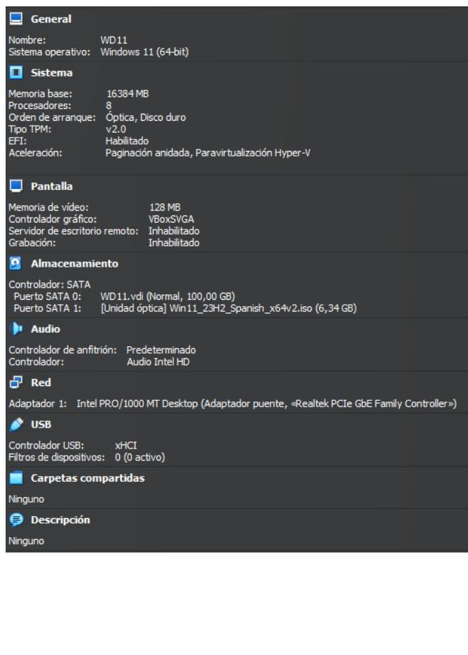

Sistemas de 64-bit
$4 \mathrm{~GB}=4096 \mathrm{MB}$ de memoria RAM
4 procesadores
TPM para Windows
Sistema EFI activado en todos.
100GB de disco duro
Habilitar en General $\rightarrow$ Avanzado el portapapeles y el arrastrar y soltar.
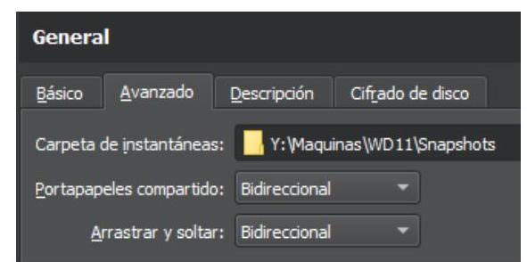

# Configuraciones Software: 

Una vez tengamos las configuraciones hardware realizadas pasaremos a descargarnos las imágenes iso, de los diferentes sistemas operativos, las agregamos a la unidad óptica e iniciamos la máquina virtual siguiendo el asistente de instalación.

En este apartado es importante poner como nombre de usuario el nombre de alumnado, y como nombre de equipo la clave del sistema y el nombre del alumnado.
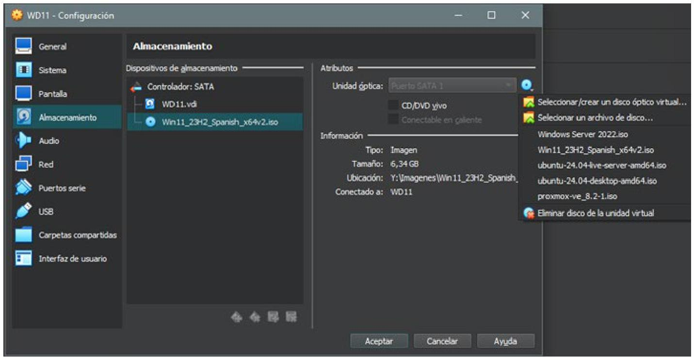

# Configuraciones básicas en Windows 

Las configuraciones básicas se basan en hacer los siguientes pasos en todas las máquinas, como ejemplo se van a realizar las mismas para un sistema operativo Windows 11:

## Paso 1 Actualizar sistemas

Para actualizar el sistema iremos a la pestaña de configuración y en la sección de Windows Update buscaremos y actualizaremos el sistema hasta la última versión disponible:
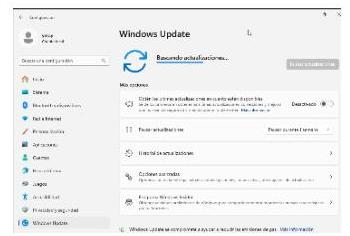

Una vez actualizado comprobaremos que nuestra versión obtenida con las teclas win $+\mathbf{R}$ y escribiendo winner en la pestaña de ejecutar coincide con la última del historial de versiones de nuestro sistemas el cual lo obtendremos de la información de la siguiente web oficial: https://learn.microsoft.com/es-es/windows/releasehealth/
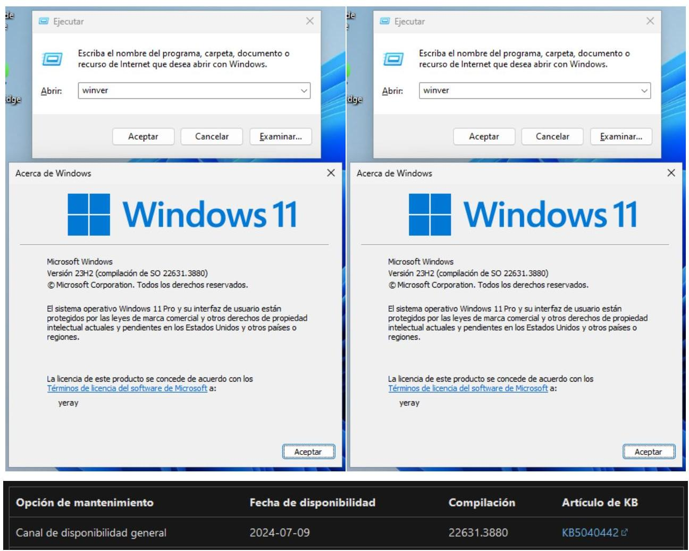

# Paso 2 Actualizar Guest Additions 

Para la instalación de las Guestt Additions en todos los sistemas el primer paso es insertar imagen de CD de los complementos del invitado...
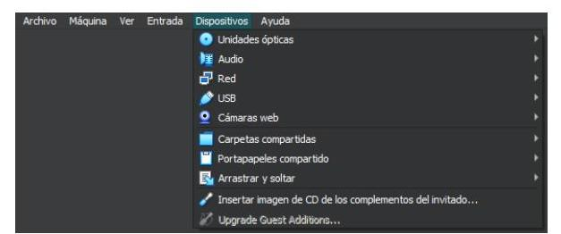

Nos vamos a la unidad de CD desde el sistema operativo y ejecutamos el programa y seguimos los pasos del asistente de instalación:
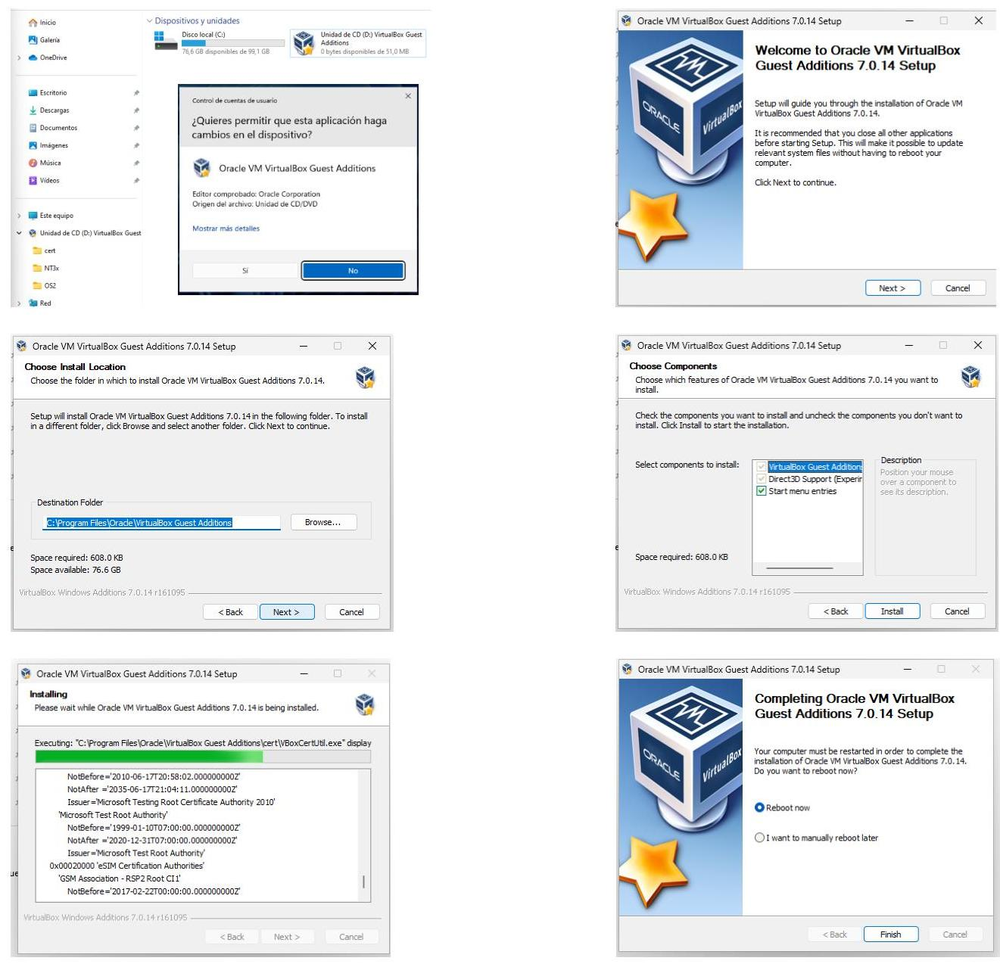

# Paso 3: Prompt en color 

Para cambiar el color del prompt en PowerShell tenemos que hacer un pequeño script, para ello abrimos el PowerShell ISE, y creamos el siguiente archivo:

IMPORTANTE Hay que respetar el nombre del archivo al igual que el código cualquier carácter incorrecto podría significar el no funcionamiento del mismo:
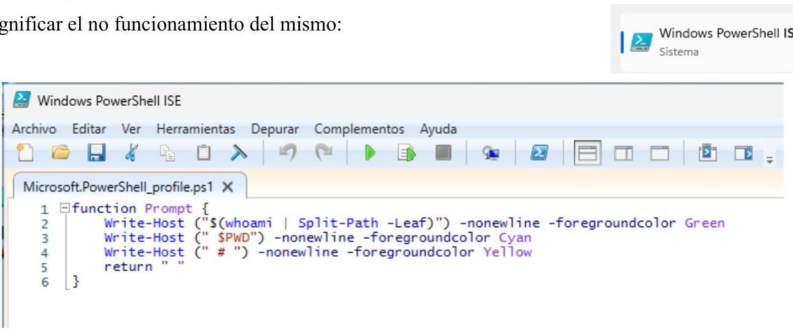

A continuación, pasamos a guardar el archivo con el nombre indicado que se muestra en la pestaña de la imagen anterior, en el directorio C:\Users\user1\Documents\WindowsPowerShell si alguna de estas carpetas no existe como por ejemplo WindowsPowerShell pues las crearemos manualmente. Recordar que user1 es el nombre de vuestro usuario en el sistema:
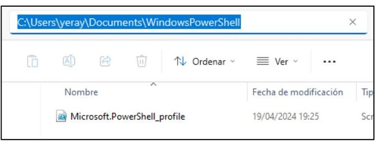

A continuación, vamos a Powershell como administrador y cambiamos las políticas de ejecución en la máquina para que nos permita ejecutar el script: Set-ExecutionPolicy Unrestricted
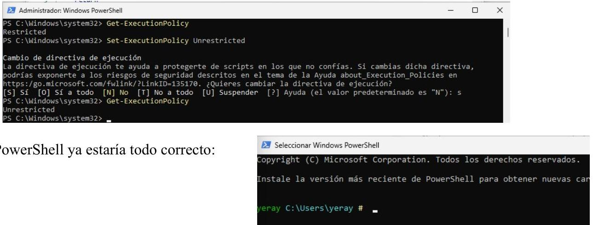

# Paso 4: Alias y atajos 

Para la creación del atajo de teclas iremos a la ruta del ejecutable de PowerShell "C:\Users\yeray\AppData\Roaming\Microsoft\Windows\StartMenu\Programs\Windows PowerShell"
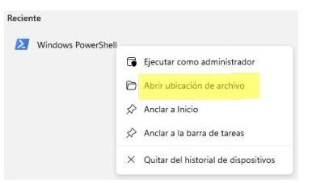

Una vez en el directorio vamos a las propiedades del archivo, pestaña Acceso directo y tecla de método abreviado y pulsamos las teclas que queremos que pasen hacer los atajos para abrir dicho programa:
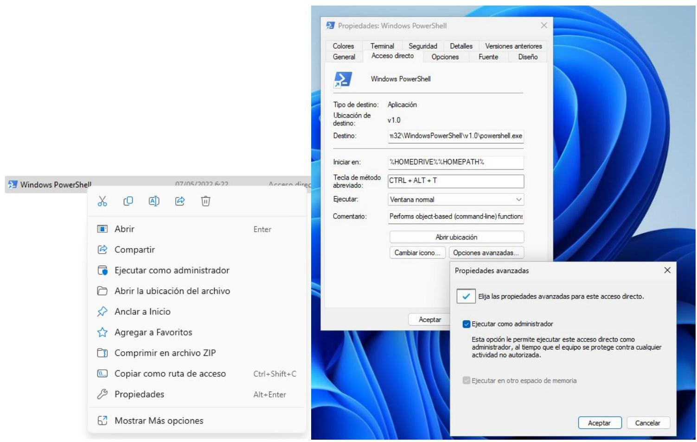

Como podemos ver en la segunda imagen se ha configurado para que el programa se ejecute como administrador ya que será el que frecuentemente usemos.

# Configuraciones básicas en Linux 

Los siguientes 5 pasos de configuraciones básicas se han de hacer en todas las máquinas base de Linux en este caso se muestra un ejemplo en Ubuntu server al no tener interfaz gráfica y ser la que presenta mayores dificultades.

## Paso 1 Actualizar sistemas

Para actualizar los equipos de Ubuntu debemos de ejecutar el siguiente comando en modo superusuario: "sudo apt update \&\& apt upgrade -y" a veces la propia terminal nos solicitara algunos comandos más en sus mensajes, deberemos realizarlo hasta que al final de la captura se muestran cuatro 0 que indican que no faltan paquetes por actualizar ni instalar.

```
veray@us24yeray: $ sudo apt update && sudo apt upgrade -y
Obj:1 http://es.archive.ubuntu.com/ubuntu noble InRelease
Obj:2 http://security.ubuntu.com/ubuntu noble-security InRelease
Des:3 http://es.archive.ubuntu.com/ubuntu noble-updates InRelease [126 kB]
Obj:4 http://es.archive.ubuntu.com/ubuntu noble-backports InRelease
Descargados 126 kB en 4s (29,2 kB/s)
Leyendo lista de paquetes... Hecho
Creando árbol de dependencias... Hecho
Leyendo la información de estado... Hecho
Todos los paquetes están actualizados.
Leyendo lista de paquetes... Hecho
Creando árbol de dependencias... Hecho
Leyendo la información de estado... Hecho
Calculando la actualización... Hecho
0 actualizados, 0 nuevos se instalarán, 0 para eliminar y 0 no actualizados.
```


## Paso 2 Actualizar Guest Additions

Para la instalación de las Guest Additions en todos los sistemas el primer paso es insertar imagen de CD de los complementos del invitado...


A continuación, creamos una carpeta (guest) montamos los directorios del CD y comprobamos su contenido, en él nos encontramos varios programas ejecutables usamos el comando sh para ejecutar las Guestt Additions de Linux y se instalen:

```
veray@us24yeray: $ mkdir guest
veray@us24yeray: $ sudo mount /dev/cdrom guest/
mount: /home/yeray/guest: HARNING: source write-protected, mounted read-only.
veray@us24yeray: $ ls guest/
AUTORUN.2NF NT8x TRANS.TBL VBoxLinuxAdditions.run VBoxWindowsAdditions.exe
mbarun.sh OS3 VBoxDarwinAdditions.pkg VBoxSolarisAdditions.pkg VBoxSindousAdditions.s25.exe
var: runasroot.sh VBoxDarwinAdditionsUninstall.tool VBoxWindowsAdditions-smd84.exe windowsll-bypass.reg
veray@us24yeray: $ sudo sh guest/VBoxLinuxAdditions.run
/verifying archive integrity... 100% MDS checksums are OK. All good.
Uncompressing VirtualBox 7.0.18 Guest Additions for Linux 100%
bzip2 not found. Please install: bzip2 tar; and try again.
```

Nos saldrá un error porque necesitamos el paquete bzip2 para poder descomprimir el contenido de las Guest Additions, lo instalamos y después ejecutamos el script:

```
veray@us24yeray: $ sudo apt install bzip2
Leyendo lista de paquetes... Hecho
Creando árbol de dependencias... Hecho
Leyendo la información de estado... Hecho
bzip2 ya está en su versión más reciente (1.0.8-5.1).
0 actualizados, 0 nuevos se instalarán, 0 para eliminar y 0 no actualizados.
yeray@us24yeray: $ sudo sh guest/VBoxLinuxAdditions.run
Verifying archive integrity... 100% MDS checksums are OK. All good.
Uncompressing VirtualBox 7.0.18 Guest Additions for Linux 100%
VirtualBox Guest Additions installer
Copying additional installer modules ...
Installing additional modules ...
VirtualBox Guest Additions: Starting.
VirtualBox Guest Additions: Setting up modules
VirtualBox Guest Additions: Building the VirtualBox Guest Additions kernel
modules. This may take a while.
VirtualBox Guest Additions: To build modules for other installed kernels, run
VirtualBox Guest Additions: /sbin/rcvboxadd quicksetup <version>
VirtualBox Guest Additions: or
VirtualBox Guest Additions: /sbin/rcvboxadd quicksetup all
VirtualBox Guest Additions: Building the modules for kernel 6.8.0-31-generic.
```

This system is currently not set up to build kernel modules.
Please install the gcc make perl packages from your distribution.
VirtualBox Guest Additions: Running kernel modules will not be replaced until
the system is restarted or 'rcvboxadd reload' triggered
VirtualBox Guest Additions: reloading kernel modules and services
VirtualBox Guest Additions: kernel modules were not reloaded
VirtualBox Guest Additions: kernel modules and services were not reloaded
The log file /var/log/vboxadd-setup.log may contain further information.
veray@us24yeray: $\$$

# Paso 3: Prompt en color 

Para cambiar el prompt de color debemos de hacer las siguientes instrucciones por cada usuario del sistema, en este manual se hará solo para el usuario administrador del root:

1. Iniciamos sesión en el usuario y vamos a su directorio personal con el comando cd, a continuación, modificamos el archivo oculto. bashrc con el siguiente comando: nano .bashrc

2. Debemos hacer dos cambios:
2.1. Eliminar el comentario, es decir eliminar el \# que aparece delante de la línea force_color_prompt=yes
2.2. Cambiar el valor de la variable PS1 que tendrá que cambiarse por lo siguiente: PS1='\$\{debian_chroot:+(\$debian_chroot)\}\[\033[01;32m\]\u@\h\[\033[00m\]: \[ \ 033[01;36m\]\w\[\033[00m\]\$ ' Obteniendo como resultado:
```
# uncomment for a colored prompt, if the terminal has the capability; turned
# off by default to not distract the user: the focus in a terminal window
# should be on the output of commands, not on the prompt
force_color_prompt=yes
```

```
if [ -n "\#force_color_prompt" ] ; then
    if [ -x /usr/bin/tput ] \&\& tput setaf 1 >\&/dev/null; then
        \# We have color support; assume it's compliant with Ecma-48
        \# (ISO/IEC-6429). (Lack of such support is extremely rare, and such
        \# a case would tend to support setf rather than setaf.)
        color_prompt=yes
    else
        color_prompt=
    fi
fi
```

```
if [ "\#color_prompt" = yes ] ; then
    PS1='\$\{debian_chroot:+(\$debian_chroot)\}\[\033[01;32m\] \u@\h\[\033[00m\]: \[ \ 033[01;36m\] \w\[\033[00m\]\$
else
    PS1='\$\{debian_chroot:+(\$debian_chroot)\}\u@\h:\w/\$ '
fi
```

```
PS1='\$\{debian_chroot:+(\$debian_chroot)\}\u@\h:\w/\$ '
```

3. Comprobamos iniciando sesión en los usuario y mostrando que sale el prompt en los colores configurados:


# Paso 4: Alias y atajos 

En este paso crearemos un alias que nos va a facilitar el trabajo durante el resto del curso y será el alias de act, para ello en el archivo anterior recordar que esto hay que hacerlo en cada uno de los usuarios del sistema, debemos añadir una línea por cada alias. Una vez abierto el archivo con nano podemos editar, buscamos la sección de los alias y añadimos la última línea que se muestra en la imagen:

## @era4@us24@eray:"\# sudo su [sudo] password for @eray: root@us24@eray:/home/yeray\# cd root@us24@eray: "\# nano .bashnc

\# some more ls aliases
alias $11=$ 'ls -alF'
alias la='ls -A'
alias $1=$ 'ls -CF'
alias act='apt update \&\& apt upgrade -u'

## Paso 5: Color de los directorios

En Linux cuando listamos los diferentes elementos tienes una serie de colores predeterminados que vienen preconfigurados en la variable SLS_COLORS en esta sección lo que haremos será cambiar el código de los directorios ya que el azul como se muestra en la captura es un color con dificultades de legibilidad en fondo negro.

```
root@us24@eray: "\# ls /
bin
bin.usr-is-menged
root@us24@eray: "\# _"
```

Los siguientes apartados se deben de hacer para cada usuario:

1. Crear el archivo oculto .dircolors formateado.

```
root@us24@eray: "\# dircolors -p > .dircolors
root@us24@eray: "\# nano .dircolors _
```

2. Editar archivo con el nano y buscar donde esta el color de los directorios (variable dir) y cambiar de 34(azul) a 32 (Verde) como se muestra en la captura.

3. Reiniciamos la sesión del usuario y comprobamos los cambios:

```
root@us24@eray: "\# ls /
bin
bin.usr-is-menged
root@us24@eray: "\#
```

# Dificultades encontradas 

## Usuario en Windows 11

En la configuración de Windows 11 nos solicita un correo electrónico para saltarnos este paso deberemos de mostrar la consola con $S H I F T+F 10$ y escribir el comando que se muestra en captura para reiniciar el proceso de instalación sin pedirte cuenta de correo.
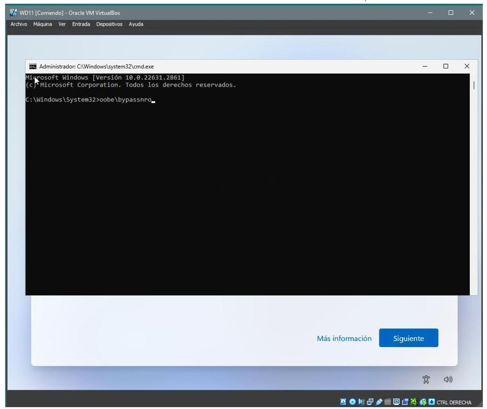

## Pantallazo negro en Ubuntu

1. En primer lugar, mirar la comprobación hardware de la máquina y comprobar el tipo de chipset:
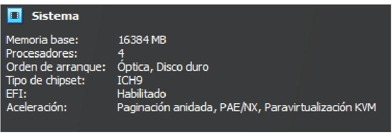
2. En caso de que siga sin funcionar pasamos al método número dos que consiste en seguir las instrucciones del siguiente video: https://youtu.be/LKIJFn6cqVE

# Problemas con la tortuga. 

Si las máquinas van muy lentas deberemos de comprobar si tenemos el error de la tortuga y solucionarlo a través del siguiente video. https://youtu.be/6FUJJN4K-2o

